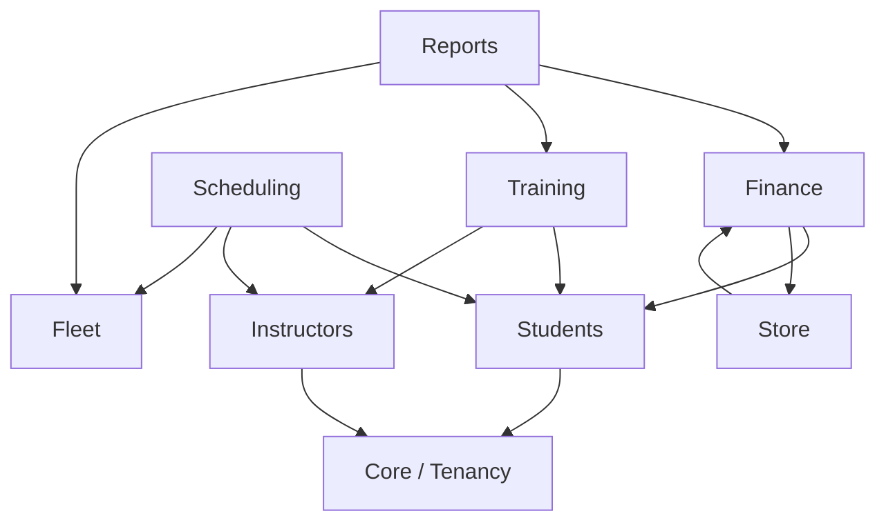

<p align="center">
  <!-- TODO: Ajouter le logo officiel du projet (ex. docs/assets/logo.png) et remplacer l'image ci-dessous -->
  
</p>

<h1 align="center">Auto-GestBoard</h1>

<p align="center">
  Plateforme SaaS multi-tenant de gestion d'auto-écoles — élèves, moniteurs, planning, facturation, flotte et examens, dans une seule application.
</p>

<p align="center">
  <a href="https://github.com/DESMOND-77/AutoGest/actions/workflows/ci.yml"></a>
  <a href="https://github.com/DESMOND-77/AutoGest/actions/workflows/codeql.yml"></a>
  <a href="CHANGELOG.md"></a>
  <a href="LICENSE"></a>
  <a href="https://github.com/DESMOND-77/AutoGest/stargazers"></a>
  <a href="https://github.com/DESMOND-77/AutoGest/network/members"></a>
  <a href="https://github.com/DESMOND-77/AutoGest/issues"></a>
</p>

---

## Table des matières

- [Fonctionnalités](#fonctionnalités)
- [Architecture](#architecture)
- [Technologies utilisées](#technologies-utilisées)
- [Prérequis](#prérequis)
- [Installation](#installation)
- [Configuration](#configuration)
- [Variables d'environnement](#variables-denvironnement)
- [Lancement en développement](#lancement-en-développement)
- [Lancement en production](#lancement-en-production)
- [Commandes utiles](#commandes-utiles)
- [Exemples d'utilisation](#exemples-dutilisation)
- [Captures d'écran](#captures-décran)
- [Structure du projet](#structure-du-projet)
- [Documentation](#documentation)
- [Roadmap](#roadmap)
- [FAQ](#faq)
- [Contribution](#contribution)
- [Sécurité](#sécurité)
- [Licence](#licence)
- [Auteurs](#auteurs)
- [Remerciements](#remerciements)

---

## Fonctionnalités

Auto-GestBoard couvre l'intégralité du cycle de vie d'une auto-école, pour quatre profils d'utilisateurs distincts :

- 🏫 **Multi-établissement (SaaS)** — chaque auto-école est un tenant isolé, avec ses propres élèves, moniteurs, véhicules, factures et plannings.
- 👤 **Quatre espaces dédiés** — Super-Admin (plateforme), Admin/Gérant, Moniteur, Élève, chacun avec sa propre interface.
- 🎓 **Cycle de vie de l'élève en 15 étapes** — de `Prospect` à `Ancien élève`, avec transitions pilotées par événements (génération de documents, notifications, facturation).
- 📅 **Planning interactif** — détection automatique des conflits d'horaires, à la fois pour le moniteur **et** pour le véhicule.
- 💳 **Facturation complète** — forfaits, factures, paiements partiels ou soldés, journal comptable (caisse/banque).
- 🚗 **Gestion de flotte** — entretiens, consommation de carburant, alertes unifiées d'expiration (contrôle technique / assurance à 30 jours).
- 📝 **Formation & examens** — suivi des compétences, résultats d'examens (code et conduite), entraînement au code théorique avec notation strictement calculée côté serveur.
- 🛒 **Boutique intégrée** — catalogue, fournisseurs, commandes (livres de code, accessoires).
- 📈 **Rapports & tableau de bord** — chiffre d'affaires, taux de réussite, alertes flotte, exports CSV.
- 🔔 **Notifications événementielles**, 📁 **gestion documentaire versionnée**, 🕵️ **journal d'audit** des actions sensibles.
- 🔒 **Isolation multi-tenant structurelle** — appliquée au niveau du framework, pas par convention (voir [Architecture](#architecture)).

## Architecture

Le projet suit une architecture **DDD modulaire** : chaque domaine métier vit sous `app/Domain/<Domaine>/` avec ses propres modèles, services, policies et contrôleurs. Les dépendances entre domaines sont unidirectionnelles et vérifiées automatiquement par des tests d'architecture Pest.



📖 Documentation complète : [docs/architecture.md](docs/architecture.md)

## Technologies utilisées

| Catégorie | Technologie |
| ---------- | ------------ |
| Langage backend | PHP 8.2+ (8.5 recommandé) |
| Framework | [Laravel 12](https://laravel.com) |
| Authentification | [Laravel Breeze](https://laravel.com/docs/starter-kits#breeze) |
| Autorisation | [Spatie laravel-permission](https://spatie.be/docs/laravel-permission) |
| Frontend | [Blade](https://laravel.com/docs/blade) + [Tailwind CSS](https://tailwindcss.com) + [Alpine.js](https://alpinejs.dev) |
| Build front-end | [Vite](https://vitejs.dev) |
| Base de données | MySQL 8.x |
| Cache / sessions / files d'attente | Redis |
| Tests | [Pest v3](https://pestphp.com) (Unit, Feature, Architecture) |
| Style de code | [Laravel Pint](https://laravel.com/docs/pint) |
| Intégration continue | GitHub Actions (tests, Pint, CodeQL, Dependabot) |
| Outils IA | [Laravel Boost](https://github.com/laravel/boost) (MCP) |

## Prérequis

- PHP ≥ 8.2 avec les extensions `mbstring`, `dom`, `fileinfo`, `pdo_mysql`, `bcmath`, `redis`
- Composer ≥ 2.x
- Node.js ≥ 20.x et npm ≥ 10.x
- MySQL ≥ 8.x
- Redis ≥ 6.x

## Installation

```bash
git clone https://github.com/DESMOND-77/AutoGest.git
cd AutoGest
composer install
npm install
cp .env.example .env
php artisan key:generate
php artisan migrate --seed
npm run build
```

📖 Guide détaillé, y compris le dépannage : [docs/installation.md](docs/installation.md)

## Configuration

La configuration se fait exclusivement via le fichier `.env` (jamais de valeur sensible codée en dur — l'ancienne version du projet avait cet écueil, corrigé dans cette version). Copiez `.env.example` vers `.env` puis ajustez les valeurs à votre environnement.

## Variables d'environnement

| Variable | Description | Valeur par défaut |
| --------- | ------------- | ------------------- |
| `APP_NAME` | Nom affiché de l'application | `Auto-GestBoard` |
| `APP_ENV` | Environnement (`local`, `production`) | `local` |
| `APP_URL` | URL de base de l'application | `http://localhost:8001` |
| `APP_TIMEZONE` | Fuseau horaire | `Africa/Libreville` |
| `APP_LOCALE` | Langue par défaut | `fr` |
| `DB_CONNECTION` | Pilote de base de données | `mysql` |
| `DB_HOST` / `DB_PORT` | Hôte / port MySQL | `127.0.0.1` / `3306` |
| `DB_DATABASE` | Nom de la base | `autoecole_jh_laravel` |
| `DB_USERNAME` / `DB_PASSWORD` | Identifiants MySQL | — |
| `SESSION_DRIVER` | Pilote de session | `redis` |
| `CACHE_STORE` | Pilote de cache | `redis` |
| `QUEUE_CONNECTION` | Pilote de file d'attente | `redis` |
| `REDIS_HOST` / `REDIS_PORT` / `REDIS_PASSWORD` | Connexion Redis | `127.0.0.1` / `6379` / `null` |
| `MAIL_MAILER` | Pilote d'envoi d'e-mail | `smtp` |
| `MAIL_FROM_ADDRESS` | Adresse d'expédition | `no-reply@auto-gestboard.com` |

Voir `.env.example` pour la liste exhaustive et [docs/deployment.md](docs/deployment.md) pour les valeurs recommandées en production.

## Lancement en développement

```bash
composer run dev
```

Cette commande unique démarre en parallèle le serveur PHP, le worker de file d'attente, les logs en direct (`php artisan pail`) et Vite en mode watch.

Comptes de démonstration après `php artisan db:seed` (mot de passe : voir vos seeders/factories locaux — **à ne jamais réutiliser en production**) :

> **TODO : Compléter avec les informations spécifiques au projet** — lister ici les comptes de démonstration une fois un `DatabaseSeeder` de démonstration complet ajouté (élève, moniteur, admin, super-admin).

## Lancement en production

```bash
composer install --no-dev --optimize-autoloader
npm ci && npm run build
php artisan migrate --force
php artisan config:cache && php artisan route:cache && php artisan view:cache
php artisan queue:restart
```

📖 Procédure complète, checklist et compatibilité [Laravel Cloud](https://cloud.laravel.com/) : [docs/deployment.md](docs/deployment.md)

## Commandes utiles

| Commande | Description |
| --------- | ------------ |
| `php artisan test --compact` | Exécute la suite de tests complète (Unit, Feature, Architecture) |
| `php artisan test --compact --filter=DomainBoundariesTest` | Vérifie les frontières entre domaines |
| `vendor/bin/pint --dirty --format agent` | Corrige le style de code sur les fichiers modifiés |
| `php artisan route:list` | Liste toutes les routes enregistrées |
| `php artisan migrate:fresh --seed` | Réinitialise la base de données (développement uniquement) |
| `php artisan fleet:check-alerts` | Envoie les alertes véhicules (contrôle technique / assurance) |
| `php artisan import:legacy-students {structure} {chemin}` | Importe les données historiques (élèves, paiements) |

## Exemples d'utilisation

**Inscrire une nouvelle auto-école (self-service, en attente de validation) :**

```
1. Un gérant se rend sur la page d'inscription publique
2. Il renseigne les informations de son établissement + son compte administrateur
3. Le Super-Admin valide la structure depuis /superadmin/structures
4. Une fois le statut passé à "actif", les comptes du tenant peuvent se connecter
```

**Planifier une séance sans conflit :**

```
1. Un admin ouvre /planning
2. Il sélectionne un élève, un moniteur, un véhicule, un créneau
3. Le système rejette automatiquement toute séance qui chevaucherait
   une séance existante pour ce moniteur OU ce véhicule
```

**Exporter le chiffre d'affaires mensuel :**

```bash
curl -L -b "laravel_session=<session_admin>" \
  https://votre-domaine.tld/reports/revenue.csv -o recettes.csv
```

Voir [docs/api.md](docs/api.md) pour l'ensemble des endpoints JSON disponibles (quiz de code, exports).

## Captures d'écran

> **TODO : Compléter avec les informations spécifiques au projet** — ajouter des captures d'écran du tableau de bord Admin, du planning interactif et de l'espace Élève dans `docs/assets/screenshots/` et les référencer ici, par exemple :
>
> ```markdown
> 
> 
> ```

## Structure du projet

```
AutoGest/
├── app/
│   ├── Domain/              Domaines métier (DDD modulaire) — voir docs/architecture.md
│   │   ├── Students/ Instructors/ Training/ Scheduling/
│   │   ├── Finance/ Store/ Fleet/ CRM/
│   │   ├── Documents/ Notifications/ Audit/
│   │   └── Reports/ Settings/ Tenancy/ Users/
│   ├── Console/Commands/    Commandes Artisan personnalisées
│   ├── Http/Controllers/    Contrôleurs transverses (Auth, Profil, Dashboard)
│   ├── Models/               Modèle User (partagé entre domaines)
│   ├── Providers/            Enregistrement des bindings et policies
│   └── Support/              Traits partagés (BelongsToTenant, TenantContext)
├── database/
│   ├── migrations/           Schéma de base de données
│   ├── factories/            Factories de test globales
│   └── seeders/              RoleSeeder, etc.
├── docs/                     Documentation technique détaillée
├── resources/views/          Vues Blade, organisées par domaine
├── routes/web.php            Routes, groupées par domaine et rôle
├── tests/
│   ├── Unit/ Feature/         Tests fonctionnels et unitaires
│   └── Architecture/          Tests de frontières entre domaines (Pest Arch)
└── .github/                   Workflows CI, templates Issues/PR, Dependabot
```

## Documentation

| Document | Contenu |
| --------- | -------- |
| [docs/architecture.md](docs/architecture.md) | Domaines, graphe de dépendances, choix technologiques, multi-tenance |
| [docs/installation.md](docs/installation.md) | Installation détaillée et dépannage |
| [docs/deployment.md](docs/deployment.md) | Déploiement production, checklist, Laravel Cloud |
| [docs/development.md](docs/development.md) | Conventions de code, tests, ajout d'un domaine |
| [docs/database.md](docs/database.md) | Schéma de base de données, relations, tenance |
| [docs/api.md](docs/api.md) | Endpoints JSON (quiz, exports CSV) |
| [CONTRIBUTING.md](CONTRIBUTING.md) | Guide de contribution complet |
| [SECURITY.md](SECURITY.md) | Politique de sécurité et signalement de vulnérabilités |
| [CHANGELOG.md](CHANGELOG.md) | Historique des versions |

## Roadmap

- [x] Phase 0 — Socle Laravel, authentification, tenance, tests d'architecture
- [x] Phase 1 — Élèves, cycle de vie, authentification
- [x] Phase 2 — Facturation (factures / paiements / journal)
- [x] Phase 3 — Planning et formation (conflits moniteur + véhicule, examens)
- [x] Phase 4 — Flotte et boutique
- [x] Phase 5 — CRM, notifications, documents, audit
- [x] Phase 6 — Domaine Instructeurs, paramètres par établissement, entraînement au code
- [ ] Interface front-end interactive pour le quiz de code (au-delà de l'API JSON actuelle)
- [ ] Import automatisé des grilles de planning historiques (`etp*.csv`, `ett*.csv`)
- [ ] Notifications SMS / paiement en ligne (Airtel Money, Moov Money)
- [ ] API publique versionnée (Sanctum) pour une éventuelle application mobile

Voir le détail phase par phase dans [docs/architecture.md](docs/architecture.md#roadmap-de-migration-depuis-lapplication-historique).

## FAQ

**Le projet gère-t-il plusieurs auto-écoles indépendantes ?**
Oui, c'est une plateforme SaaS multi-tenant : chaque établissement (`structure`) dispose de ses propres élèves, moniteurs, véhicules et factures, avec une isolation garantie au niveau du framework (voir [docs/architecture.md](docs/architecture.md#multi-tenance)).

**Comment un nouvel établissement rejoint-il la plateforme ?**
Via l'inscription publique, qui crée un compte en attente. Le Super-Admin doit valider la structure avant que ses utilisateurs puissent se connecter.

**Puis-je utiliser une autre base de données que MySQL ?**
Le projet cible MySQL 8.x. D'autres SGBD compatibles Eloquent peuvent fonctionner mais ne sont pas testés ni supportés officiellement.

**Comment sont calculées les notes du quiz de code ?**
Exclusivement côté serveur : le client ne reçoit jamais les bonnes réponses avant la soumission. Voir [docs/api.md](docs/api.md#entraînement-au-code-quiz).

**J'ai une autre question.**
Ouvrez une [Issue de type Question](.github/ISSUE_TEMPLATE/question.md) ou consultez les [Discussions](https://github.com/DESMOND-77/AutoGest/discussions).

## Contribution

Les contributions sont les bienvenues ! Merci de lire le [guide de contribution](CONTRIBUTING.md), qui détaille les conventions de commit, la stratégie de branches, le style de code et le processus de revue.

En résumé :

```bash
git checkout -b feature/ma-fonctionnalite dev
# ... vos modifications, avec tests ...
vendor/bin/pint --dirty --format agent
php artisan test --compact
git commit -m "feat(domaine): description au présent"
git push origin feature/ma-fonctionnalite
# puis ouvrez une Pull Request vers dev
```

Ce projet adhère au [Code de conduite Contributor Covenant](CODE_OF_CONDUCT.md).

## Sécurité

Merci de **ne jamais signaler une vulnérabilité via une Issue publique**. Consultez la [politique de sécurité complète](SECURITY.md) pour la procédure de signalement responsable et les délais de réponse.

## Licence

Ce projet est distribué sous licence [MIT](LICENSE).

## Auteurs

- **[DESMOND-77](https://github.com/DESMOND-77)** — création et développement

Voir aussi la liste des [contributeurs](https://github.com/DESMOND-77/AutoGest/graphs/contributors).

## Remerciements

- [Laravel](https://laravel.com) et son écosystème (Breeze, Pint, Boost, Pest)
- [Spatie](https://spatie.be) pour `laravel-permission`
- [Tailwind CSS](https://tailwindcss.com) et [Alpine.js](https://alpinejs.dev)
- L'auto-école J/H, à l'origine du cahier des charges métier ayant guidé la conception de cette plateforme
