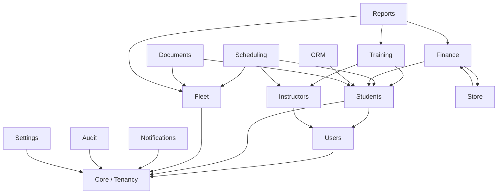

# Architecture

## Vue d'ensemble

Auto-GestBoard est une application **Laravel 12** monolithique, organisée en **domaines métier (Domain-Driven Design modulaire)** plutôt qu'en couches techniques classiques (`Models/`, `Controllers/` globaux). Chaque domaine est un module autonome sous `app/Domain/<Domaine>/`.

Ce choix remplace l'architecture procédurale de l'application historique (`autoecole_jh`, PHP vanille, une page = un contrôleur + une requête SQL + une vue), où la logique métier était dupliquée entre plusieurs pages et où l'isolation multi-tenant dépendait de la discipline de chaque développeur plutôt que d'une garantie structurelle.

## Principe directeur

> Une règle métier ne s'écrit qu'une seule fois, dans un `Service` du domaine concerné - jamais dans un Contrôleur, jamais dans une vue Blade, jamais dupliquée entre deux domaines.

## Domaines métier

| Domaine         | Dossier                        | Responsabilité |
| ---------------- | ------------------------------- | -------------- |
| Core / Tenancy    | `app/Domain/Tenancy/`           | Modèle `Structure` (tenant), cycle de vie d'un établissement (`en_attente` → `actif` → `suspendu`/`désactivé`) |
| Users             | `app/Domain/Users/`             | Comptes utilisateurs, rôles (Spatie `laravel-permission`) |
| Students          | `app/Domain/Students/`          | Élèves, cycle de vie (15 étapes, de `Prospect` à `AncienEleve`) |
| Instructors       | `app/Domain/Instructors/`       | Profils moniteurs, disponibilités hebdomadaires |
| Training          | `app/Domain/Training/`          | Compétences, évaluations, examens, quiz de code |
| Scheduling        | `app/Domain/Scheduling/`        | Séances, détection de conflits (moniteur et véhicule) |
| Fleet             | `app/Domain/Fleet/`             | Véhicules, entretiens, carburant, alertes d'expiration |
| Finance           | `app/Domain/Finance/`           | Forfaits, factures, paiements, journal comptable |
| Store             | `app/Domain/Store/`             | Catalogue produits, fournisseurs, commandes |
| CRM               | `app/Domain/CRM/`               | Prospects et conversion en élève |
| Documents         | `app/Domain/Documents/`         | Gestion électronique de documents (polymorphe, versionnée) |
| Notifications     | `app/Domain/Notifications/`     | Notifications pilotées par événements |
| Audit             | `app/Domain/Audit/`             | Journal des actions sensibles |
| Reports           | `app/Domain/Reports/`           | Agrégats en lecture seule, tableau de bord, exports CSV |
| Settings          | `app/Domain/Settings/`          | Configuration par établissement |

Chaque domaine expose, selon ses besoins :

```
app/Domain/<Domaine>/
├── Models/          Modèles Eloquent (BelongsToTenant, HasFactory)
├── Services/         Logique métier - le seul endroit où une règle est écrite
├── Repositories/      Interface + implémentation Eloquent (pour l'agrégat principal)
├── Policies/          Autorisation (tenant + relation métier)
├── Http/
│   ├── Controllers/   Fins - orchestrent un appel Service, aucune logique métier
│   ├── Requests/       Validation des entrées
│   └── Resources/      Sérialisation JSON explicite (whitelist des champs exposés)
├── Enums/             États et catégories typés
├── Events/ Listeners/  Effets de bord découplés (notifications, journal, etc.)
├── Database/Factories/ Factories de test
└── Jobs/               Traitement asynchrone (le cas échéant)
```

## Graphe de dépendances entre domaines

Les dépendances entre domaines sont **unidirectionnelles** et vérifiées automatiquement par des tests d'architecture Pest (`tests/Architecture/DomainBoundariesTest.php`). Par exemple, `Finance` peut lire un `Student`, mais `Students` ne doit jamais dépendre de `Finance`.



Cette contrainte empêche la réapparition d'un couplage direct comme celui observé dans l'application historique, où la page d'entretien de véhicule écrivait directement dans la table financière des transactions.

## Multi-tenance

La tenance est **row-level** : chaque table métier porte une colonne `structure_id`, filtrée automatiquement par le trait `App\Support\BelongsToTenant` (scope Eloquent global + auto-remplissage à la création), résolu par le middleware `ResolveTenant` à partir de la session.

- Le Super-Admin est hors-tenant (`structure_id = null`), avec un Guard/Gate dédié.
- Toute mutation passe par une **Policy** qui vérifie à la fois l'appartenance au tenant **et** la relation métier (ex. un moniteur ne peut évaluer que ses élèves assignés).
- Les contraintes d'unicité (email, immatriculation) sont **scopées par tenant** (`unique(structure_id, colonne)`), et non globales.

> ⚠️ Le binding de modèle implicite (`{student}` dans une route) est résolu **avant** que le middleware de tenance n'ait posé le tenant courant. La protection contre l'accès inter-tenant sur ces routes repose donc sur les Policies, pas uniquement sur le scope global. Toute nouvelle route utilisant un binding de modèle doit vérifier une Policy correspondante.

## Choix technologiques

| Aspect          | Choix                                   | Justification |
| ---------------- | ----------------------------------------- | -------------- |
| Frontend          | Blade + Tailwind CSS + Alpine.js          | Rendu serveur, pas de besoin SPA identifié, délai de mise en œuvre plus court |
| Authentification  | Laravel Breeze + sessions                 | Modèle 100 % session, extensible vers une API publique via Sanctum si besoin futur |
| RBAC              | Spatie `laravel-permission`               | Rôles/permissions déclaratifs plutôt que des tableaux de rôles codés en dur |
| Multi-tenance     | Row-level (`structure_id` + scope global) | Cohérent avec l'historique du projet, coût opérationnel moindre qu'une base par tenant |
| File d'attente / cache | Redis                                 | Nécessaire pour les jobs asynchrones et le cache applicatif |
| Base de données   | MySQL 8                                    | Voir [docs/database.md](database.md) |

## Roadmap de migration depuis l'application historique

Approche *strangler fig* (module par module, sans interruption du système existant) :

| Phase | Contenu | Statut |
| ----- | -------- | ------ |
| 0 - Socle | Squelette Laravel, Breeze, Spatie permission, Tenancy, tests d'architecture | ✅ |
| 1 - Users / Students / Auth | Cycle de vie élève, contraintes tenant | ✅ |
| 2 - Finance | Factures / paiements / journal comptable | ✅ |
| 3 - Scheduling + Training | Conflits de planning, formation, examens | ✅ |
| 4 - Fleet + Store | Flotte, boutique | ✅ |
| 5 - CRM + Notifications + Documents + Audit | Modules entièrement nouveaux | ✅ |
| 6 - Reports + bascule | Tableau de bord BI, export, dépréciation de l'ancien dépôt | 🚧 en cours |

Voir également [docs/development.md](development.md) pour les conventions de développement au sein d'un domaine.
