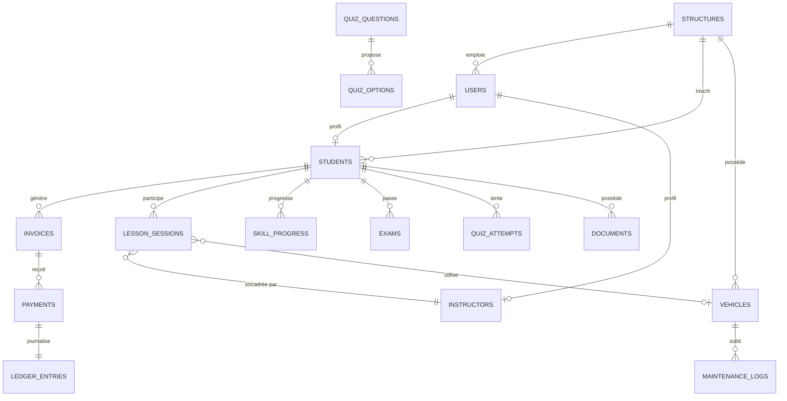

# Base de données

## Moteur

MySQL 8.x, encodage `utf8mb4` / collation `utf8mb4_unicode_ci`. Toutes les requêtes passent par Eloquent ou le Query Builder Laravel (requêtes préparées systématiques - aucun SQL brut concaténé avec une entrée utilisateur).

## Principe de tenance

Chaque table métier porte une colonne `structure_id` (clé étrangère vers `structures`), toujours en première position après `id()`. Le filtrage par tenant est appliqué automatiquement par le trait `App\Support\BelongsToTenant` sur les modèles concernés - voir [docs/architecture.md](architecture.md#multi-tenance).

Les tables sans lien direct avec une structure (ex. `quiz_options`, scopée via `quiz_questions`) sont volontairement rattachées à leur parent plutôt que de dupliquer la colonne, conformément à une décision explicite documentée dans le modèle concerné.

## Tables principales par domaine

| Domaine | Tables |
| -------- | ------- |
| Tenancy | `structures` |
| Users | `users`, tables Spatie `roles` / `permissions` / `model_has_roles` |
| Students | `students` |
| Instructors | `instructors`, `instructor_availabilities` |
| Scheduling | `lesson_sessions` |
| Training | `skills`, `skill_progress`, `exams`, `quiz_questions`, `quiz_options`, `quiz_attempts`, `quiz_attempt_answers` |
| Finance | `training_packages`, `invoices`, `payments`, `ledger_entries` |
| Fleet | `vehicles`, `maintenance_logs`, `fuel_logs` |
| Store | `suppliers`, `products`, `orders`, `order_items` |
| CRM | `leads` |
| Documents | `documents` (table polymorphe, versionnée) |
| Notifications | `notifications` |
| Audit | `audit_logs` |
| Settings | `settings` (une ligne par tenant) |

## Relations clés



## Points d'attention hérités de l'audit de l'ancienne application

Ces corrections structurelles distinguent ce schéma de celui de l'application historique :

| Ancien schéma | Schéma actuel |
| --------------- | -------------- |
| `email` unique globalement | `unique(structure_id, email)` |
| `immatriculation` unique globalement | `unique(structure_id, plate)` |
| Une seule table `paiements` (facture + règlement confondus) | Séparation `invoices` (dû) / `payments` (réglé) / `ledger_entries` (journal) |
| Colonnes de chemin de fichier éparpillées (`photo`, `cni_path`...) | Table `documents` polymorphe, versionnée |
| Table `notifications` jamais alimentée en écriture | Domaine piloté par événements → écouteurs → notification effective |

## Import de données historiques

Voir la commande `php artisan import:legacy-students {structure} {chemin}` (documentée dans [docs/installation.md](installation.md#import-des-données-historiques-optionnel)), qui convertit le format plat de l'ancienne table `paiements` vers le couple `invoices`/`payments` actuel.

## Migrations

```bash
# Appliquer les migrations en attente
php artisan migrate

# Réinitialiser complètement la base (développement uniquement)
php artisan migrate:fresh --seed
```

> **TODO : Compléter avec les informations spécifiques au projet** - schéma de sauvegarde/restauration et politique de rétention des données personnelles (élèves, documents) à documenter avant tout déploiement en production, notamment au regard des obligations de protection des données applicables.
